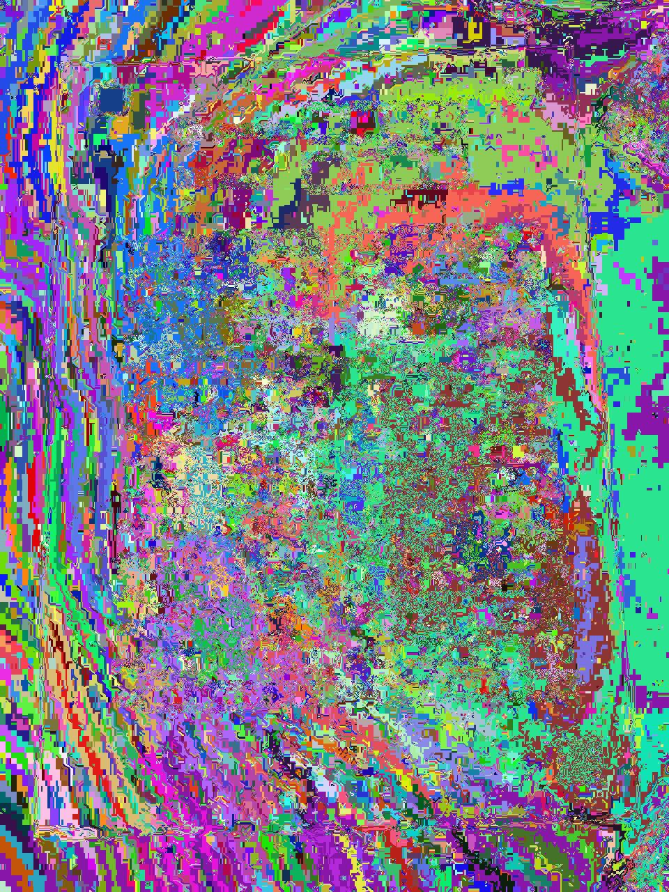
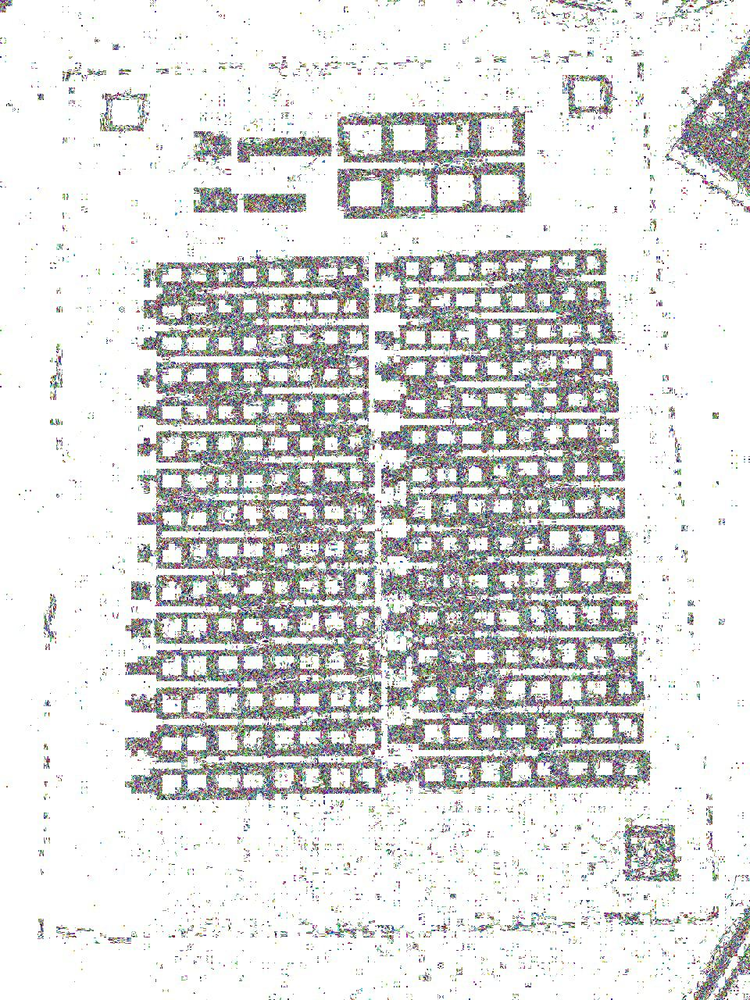
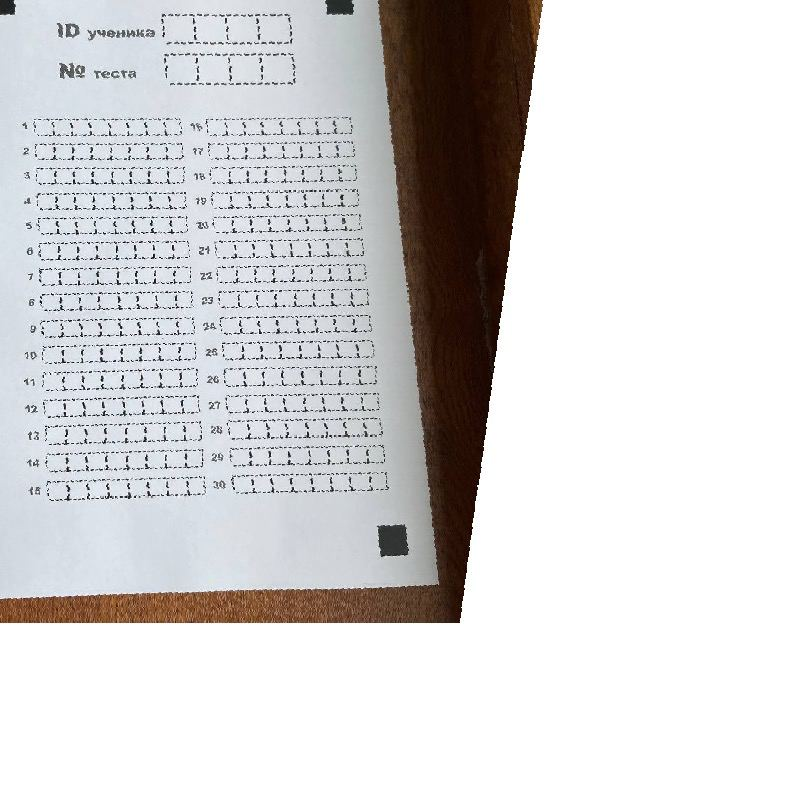
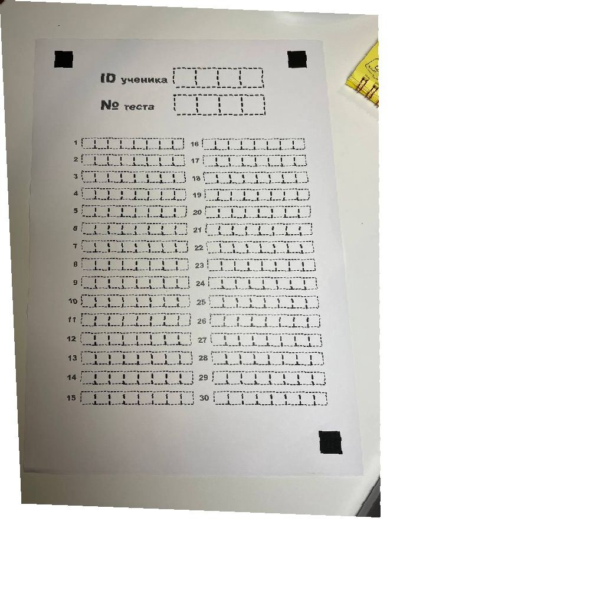
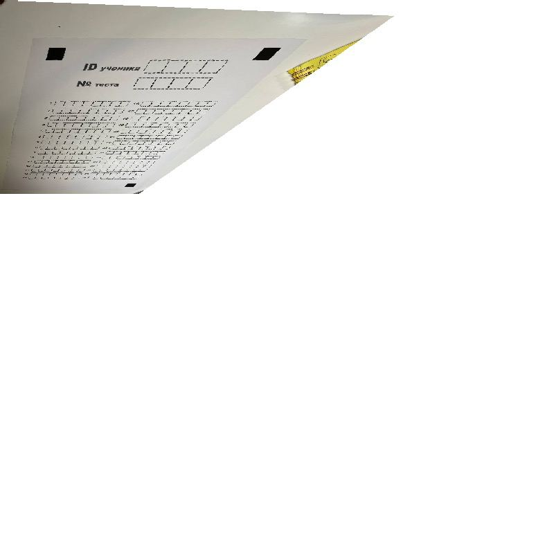
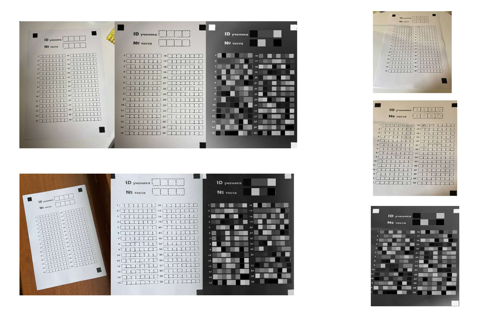
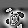
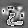
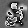

    

### What is TuckleJudge?
It's a system that allows your educational organization 
to check offline tests faster with an ability of sharing 
students' mistakes faster and in more elegant way.

**[TuckleJudge intro movie](https://vimeo.com/743428966)**

### User instructions
Initially you have to register student account with `_admin` name.

Now you have a capability of creating `teacher` account.
`Verification code` for it is written on the main page of `_admin` account.
It's being changed every 2 days. `student` account can be created
without this code.

As you created a `teacher` account you get the option of creating/editing/checking tests
and viewing checked tests' summary. `students` can only view their own tests.

### How does fields recognition work

Initially I thought about the idea of multiplying 
greyscale pixels' values on a large numbers like 250.
As you can see on the image below, picture after such operation can be 
split on multiple near lying components as though on puzzles from 
which the picture is combined, and size of each component depends on 
the number of various details on the fragment. 
It's clear that the fields of the test list are full of details 
and that's how we can distinguish it from the other parts of the image.

    
    

But it used to work only on a specific type of images, 
only with specific noise or something. 
I've spent too much time on the process of exploration,
but it hadn't paid off, so I put it off.

#### Another algoritm
Initially program receives a photo of the test and converts it to greyscale.
Then threshold applies and various components are detected using
plain bfs. After that algorithm detects components which areas shape is similar to a square.
That's how it detects these 3 black squares. Then it's applying various transformation 
depending on these 3 squares positions: rotation, shear, flipping, perspective transformation.

    
    
    

Then I'm detecting fields by basic bfs again).
Then each field splits to a multiple digit images.
So simple to be true, but it took me few days to implement.

    

[//]: # (![]&#40;README_src/fields_recognition_on_photos.png&#41;)

### How does digit recognition works (haha, this part is really odd, maybe change it to a normal one later)
_It's not ideal yet, I'd say it's pretty far from being called that way.
It's disgusting filthy stinky muddy bastard shit creation.
It's just full of horrorshow arrogance, nothing nobel in it. Just a shitty thing.
Can't stand it.  Ok, ok... calm down. Yes, I've done it on my oddy knocky.
Bold queer poo - just having no healthy thoughts about it.
Eh, that's right so what is it about. And why am I harshly bewaring it._

So, initially I was told that this problem could be solved easily by single **PERCEPTRON** layer.
That's true, single perceptron layer can be trained on MNIST database having pretty nice results - 
`86%` detected photos. But using the same model on my own dataset (created by _fields' detector_)
is just an absurd, it had literally zero accuracy.
So I had to experiment with a lot of image alterations to make MNIST images look mostly identical to mine.
Then I used gathered all my ML knowledge and created perceptron models for all the digits. But it crushed, 
just refused to work properly. `60%` accuracy, by God, it's enormously tiny number.

    
    
    

**_BTW, the algorithm was quite interesting and amusing, pretty technological at some point, 
so if you're interested in the way I've implemented it, 
check out my [Telegram channel](https://t.me/mt19937_seed_228)._**

Then I brought CNN from [this repository](github.com/rubenwo/cnn-go), wrote all the functions for image transformation 
and for saving layers to file. And what??? It's just unfair. 
This CNN can obtain only one convolutional layer 
because it just crushed if I used some different model from what the author presented.
And I found out that the bug was in the divisions by zero, cringe exponential functions, 
unsafe operations with numbers. So the whole thing was a mess. 
It's my subjective thought so don't blame me if it's not fully accurate, but it won't change my mind(, 
coz the CNN presented in that repository was something weird. So I wanted to create mine.
But at the time summer had approached the finish line, and I had a lot of other things to do, so I called it a day at that point.